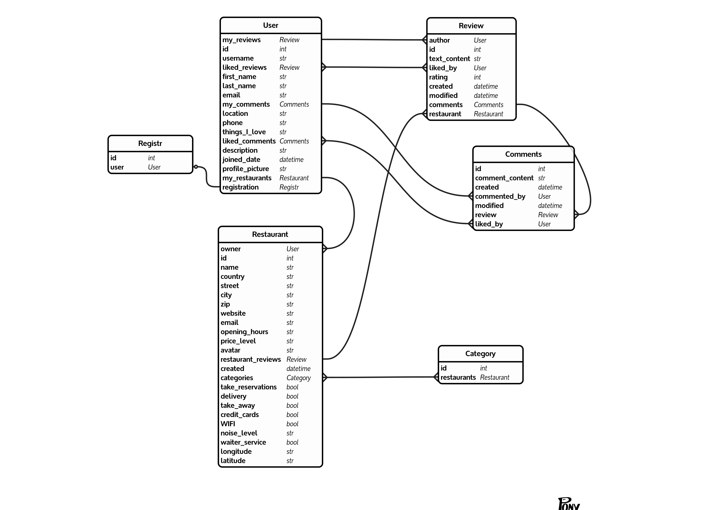

Welcome to Luna Capricorn's Team Project! 

-------------------------------------

# Frontend: 
our website: https://luna.propulsion-learn.ch/ (no longer active)
feel free to contact us at: lunaproject2021@gmail.com

# Backend: 
API's documentation: /api/docs/
API written with Concrete View Classes

Entity Relationship Diagram ORM Model:

created on https://editor.ponyorm.com/

## to have the website run locally
* pull
### for frontend only
* from the frontend folder run yarn install and then yarn start

### to have the server run locally as well
* first build the image, from the root folder run the commands: 
* docker build -t luna .
* docker-compose up
